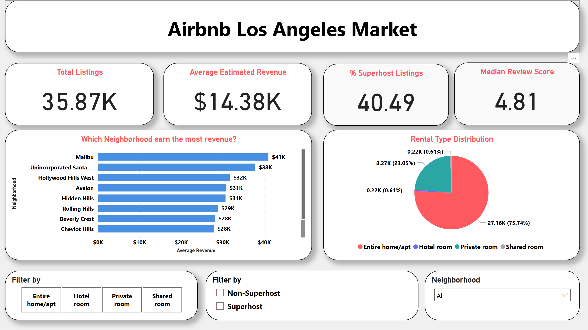
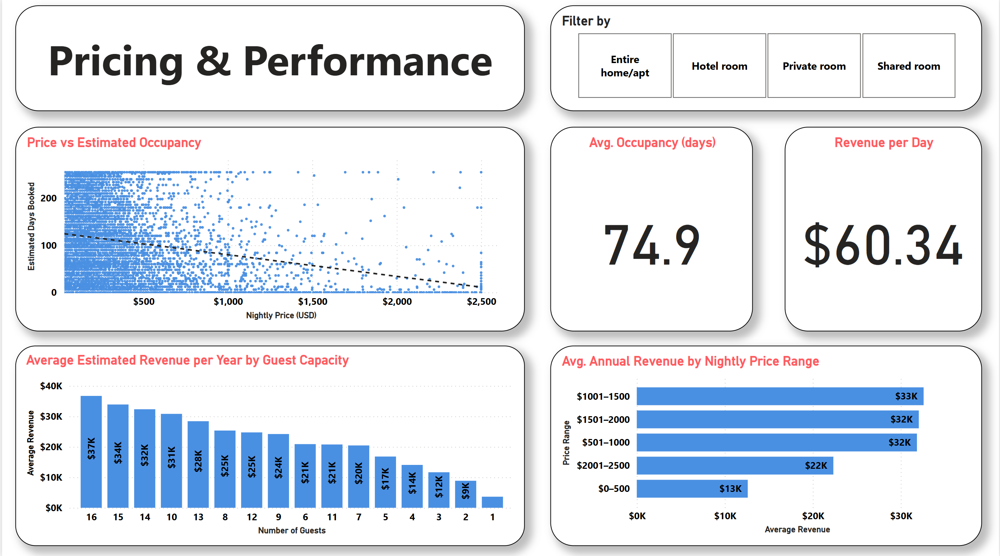
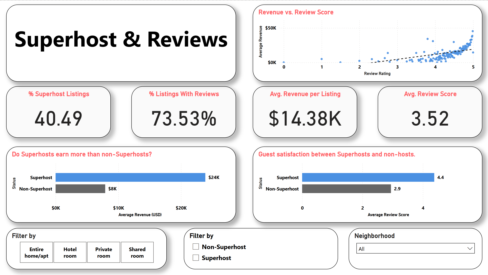
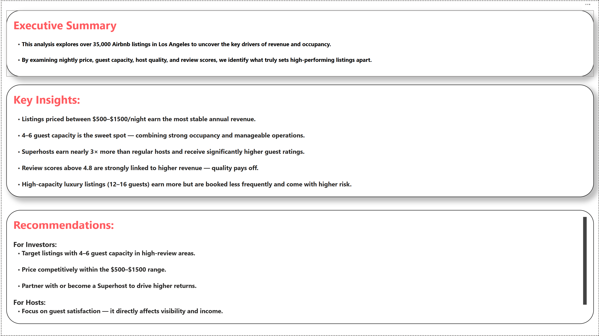

# Airbnb Market Analysis – Los Angeles (Power BI + Python)

## Project Structure

airbnb-la-market-analysis/
├── notebooks/
│   └── airbnb_data_cleaning.ipynb
├── report/
│   └── Airbnb_LA_Analysis.pbix
├── images/
│   └── dashboard_summary.png
├── data/
│   └── airbnb_la_cleaned.csv
└── README.md

## Project Overview

This project analyzes over 35,000 Airbnb listings in Los Angeles to uncover what drives estimated revenue and guest satisfaction. It combines data cleaning and exploratory analysis in Python with a dynamic Power BI dashboard.

Using real data from Inside Airbnb, the analysis explores:
- Neighborhood revenue performance
- Pricing strategies and occupancy patterns
- Impact of Superhost status and review scores

---

## Business Questions

- Which listing types generate the most revenue?
- How does nightly price affect occupancy and revenue?
- Do Superhosts outperform non-Superhosts in earnings and ratings?
- Which neighborhoods are best positioned for investment?

---

## Key Insights

- Listings priced between \$500–\$1500 per night generate the most stable annual revenue.
- The 4–6 guest capacity range balances high occupancy and strong returns.
- Superhosts earn nearly 3× more revenue and consistently have better reviews.
- Listings with review scores above 4.8 tend to earn significantly more.
- Large group listings (12–16 guests) earn high revenue but are booked less frequently.

---

## Tools Used

- Python (Pandas, Matplotlib): Data cleaning and EDA
- Power BI: Dashboard development and data modeling
- DAX: Calculated measures (revenue, occupancy, pricing bands)
- Dataset Source: [Inside Airbnb – Los Angeles](http://insideairbnb.com/get-the-data.html)

---

## Dashboard Preview

